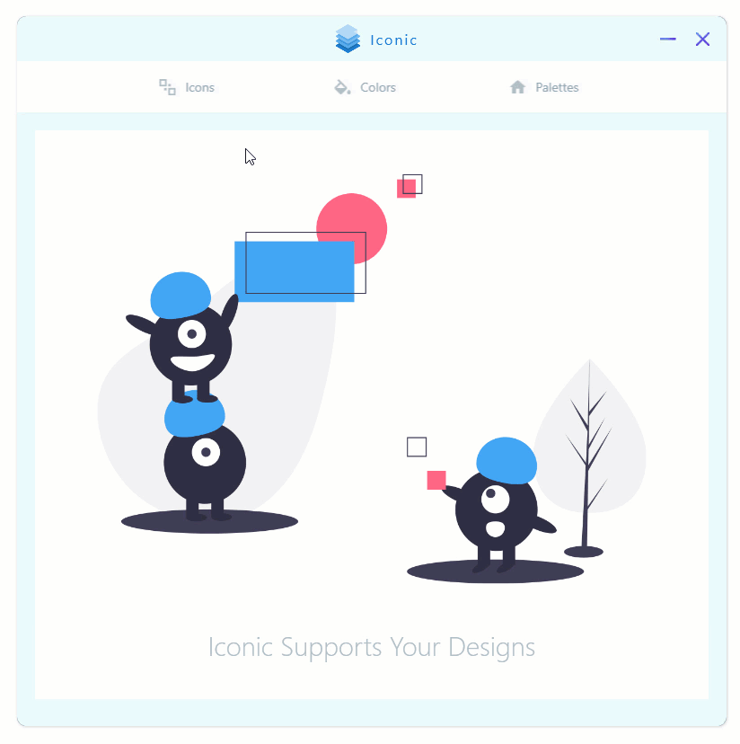
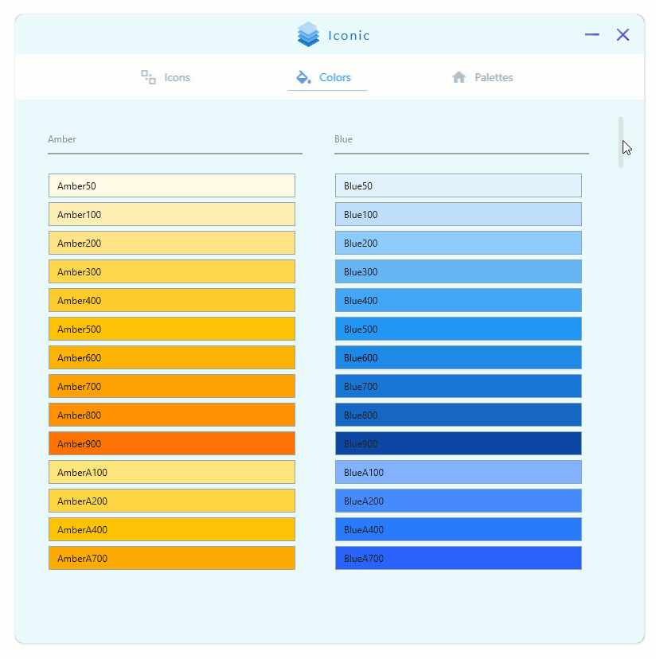
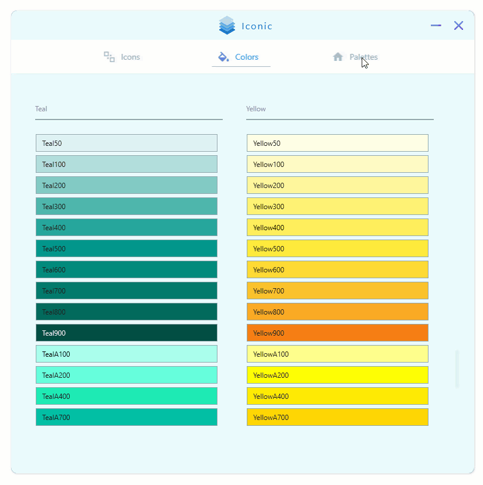

# Iconic
Useful assets for developers and designers

# Icons

# Colors

# Palettes

## Credits

- <a href="https://materialdesignicons.com/">Material Icons</a>
- <a href="https://material.io/design/color/the-color-system.html#tools-for-picking-colors">Material Colors</a>
- <a href="https://github.com/Jam3/nice-color-palettes/">Color Palettes</a>

App Icon: 

Icons made by <a href="https://www.flaticon.com/authors/freepik" title="Freepik">Freepik</a> from <a href="https://www.flaticon.com/" title="Flaticon"> www.flaticon.com</a>